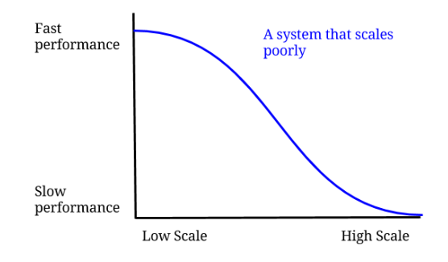

# System Design
### Table of Contents

1. [Definition](#definition)
2. [How To: System Design?](#how-to-system-design)
3. [Distributed System](#distributed-system)
4. [Performance v/s Scalability](#performance-vs-scalability)
5. [Latency vs Throughput](#latency-vs-throughput)
6. [Availability vs Consistency](#availability-vs-consistency)
7. [Content Delivery Network](#content-delivery-network)
8. [Domain Name System (DNS)](#domain-name-system-dns)
9. [Proxy Servers](#proxy-servers)
10. [Load Balancers](#load-balancers)
11. [Horizontal Scaling](#horizontal-scaling)
12. [Database](#database)
13. [Microservices](#microservices)
14. [Caching](#caching)
15. [Asynchronism](#asynchronism)
16. [Performance Antipatterns](#performance-antipatterns)
# Definition

**System design is the thoughtful and detailed planning process in computer science and engineering, akin to meticulously crafting a blueprint before building a treehouse. It involves determining the overall structure (architectural design), where data will be stored and accessed (data design), how different parts will interact (interface design), defining step-by-step processes (procedural design), and ensuring security measures (security design).**

It involves taking a problem statement, breaking it down into smaller components, and designing each component to work together effectively to achieve the overall goal of the system. This process typically includes analyzing the current system (if any) and determining any deficiencies, creating a detailed plan for the new system, and testing the design to ensure that it meets the requirements. It is an iterative process that may involve multiple rounds of design, testing, and refinement.

In software engineering, system design is a phase in the software development process that focuses on the high-level design of a software system, including the architecture and components

# **How To: System Design?**

Several steps can be taken when approaching a system design:

- **Understand the problem**: Gather information about the problem you are trying to solve and the requirements of the system. Identify the users and their needs, as well as any constraints or limitations of the system.
- **Identify the scope of the system:** Define the boundaries of the system, including what the system will do and what it will not do.
- **Research and analyze existing systems:** Look at similar systems that have been built in the past and identify what worked well and what didn’t. Use this information to inform your design decisions.
- **Create a high-level design:** Outline the main components of the system and how they will interact with each other. This can include a rough diagram of the system’s architecture, or a flowchart outlining the process the system will follow.
- **Refine the design:** As you work on the details of the design, iterate and refine it until you have a complete and detailed design that meets all the requirements.
- **Document the design:** Create detailed documentation of your design for future reference and maintenance.
- **Continuously monitor and improve the system:** The system design is not a one-time process, it needs to be continuously monitored and improved to meet the changing requirements.

## Distributed System:

A distributed system is a collection of independent computers (or nodes) that work together as a unified computing resource. These nodes are geographically dispersed and communicate with each other through a network, collaborating to achieve a common goal. Unlike a centralized system where all processing occurs in one location, a distributed system distributes computation and data across multiple nodes.

1. Concurrency: Nodes in a distributed system operate concurrently, performing tasks simultaneously.
2. Autonomy: Each node in the system has a degree of autonomy, meaning it can operate independently.
3. Communication: Communication is fundamental in distributed systems. Nodes share information, coordinate tasks, and synchronize their actions through communication channels.
4. Scalability: Distributed systems are designed to be scalable, meaning that they can efficiently handle an increasing number of nodes or a growing workload.

# Performance v/s Scalability

`How do I know if I have a **Performance problem**`: If your system is slow for a single user also, then there is a performance problem.

`How do I know if I have a **Scalability Problem?**` : If your system is fast for a single user but slow under heavy load.

Let’s get definitions out of the way. Scalability is being able to handle large amounts of users/data/traffic. Performance is about speed. While the speed of light may be constant, the software system speed is far from that.

## Performance:

Performance in system design refers to how well a computer system executes its tasks and meets its objectives. It encompasses various factors that influence the efficiency, speed, and responsiveness of a system. Optimizing performance is crucial to ensure that the system delivers a satisfactory user experience and operates effectively under different conditions. Let's delve into the key aspects of performance in the context of system design:

## Scalability:

*A service is said to be scalable if when we increase the resources in a system, it results in increased performance in a manner proportional to the resources added*.

Increasing performance in general means serving more units of work, but it can also be to handle larger units of work, such as when datasets grow.

Why is scalability so hard? Because scalability cannot be an afterthought. It requires applications and platforms to be designed with scaling in mind, such that adding resources actually results in improving the performance or that if redundancy is introduced the system performance is not adversely affected. Scalability is making sure that the performance is constant no matter how many people are coming in.

`Cashier Example of a Super Market.`

One tactic used is to add caching. In some cases, you may need to process a lot of data for a user. But if that data needs to be processed the same many times, then it may be worth just saving the final result.

# Latency vs Throughput

## Latency:

> *Latency refers to the amount of time it takes for a system to respond to a request. It is often measured in milliseconds or microseconds.*
> 

Latency is a measure of how long it takes for a system to complete a task or process data. High latency can lead to slow performance, while low latency can result in faster and more responsive systems.

Latency can be caused by various factors e.g., network i.e. time it takes for data to travel through the network (more hops, high latency), network congestion, inefficient algorithms, load on the resources, and so on.

## Throughput

> *Throughput refers to the number of requests a system can handle at the same time. It is often measured in requests per second, transactions per second, or bits per second.*
> 

Throughput is an important metric to consider when designing and evaluating systems such as networks, storage systems, and databases. High throughput can lead to more responsive systems and more efficient use of resources, while low throughput can result in slow performance and increased latency.

Throughput can be limited by various factors, such as the capacity of the systems involved, the number of available resources, and the efficiency of the algorithms used to process the data. For example, in a network, throughput can be limited by the bandwidth available or the number of connections that can be made at the same time. In a computer, it can be limited by the CPU or memory capacity.

## **Relationship Between Latency and Throughput**

In most systems, there is a trade-off between latency and throughput, as increasing throughput often requires sacrificing some of the time it takes for the system to respond to each individual request (latency). Therefore, when designing and evaluating systems, it is important to consider both latency and throughput to find the right balance.

One way to increase throughput is to add more servers to the system, which allows the system to handle more requests simultaneously. However, this can lead to increased latency, as the requests may need to be routed to different servers and the data may need to be replicated across those servers.

# Availability vs Consistency

## Availability:

Availability means tumhara system humesha available rhe hai jab bhi tumhe uski zarurat ho. without guaranteeing that the response contains the most recent or consistent version of the data. It prioritizes uninterrupted access to the system even when certain parts might be experiencing failures or delays.

## Consistency:

Refers to the agreement that all nodes in a distributed system will have the same view of data at the same time. In other words, if one node updates the data, all other nodes should reflect that update immediately.

Achieving consistency involves synchronizing the data across all nodes, which might introduce additional latency to ensure that updates are propagated and acknowledged by all parts of the system before considering the operation complete.

## Partition Tolerance:

Partition Tolerance addresses the system's ability to continue functioning even when communication between nodes is disrupted or delayed due to network partitions. A network partition occurs when nodes are unable to communicate with each other, creating isolated groups within the distributed system.

Partition Tolerance addresses the system's ability to continue functioning even when communication between nodes is disrupted or delayed due to network partitions. A network partition occurs when nodes are unable to communicate with each other, creating isolated groups within the distributed system.

## CAP Theorem

The CAP theorem states that in a distributed system, it's impossible to simultaneously achieve all three goals of Consistency, Availability, and Partition Tolerance. You can prioritize two out of the three, but the third will have to be sacrificed to some extent.

For example, a system might prioritize Consistency and Availability but sacrifice Partition Tolerance, meaning it might not function correctly when some nodes are isolated. On the other hand, a system might prioritize Availability and Partition Tolerance but sacrifice Consistency, potentially leading to situations where different nodes show slightly different versions of the data.

## Consistency Patterns:

1. **Weak Consistency:** 
    
    Weak Consistency allows for a considerable degree of flexibility in the timing and ordering of operations across different nodes in a distributed system. There is no strict requirement for immediate synchronization, and nodes might observe different versions of the data for a period.
    Example:
    
    Think of a social media platform where you post a photo. In a weakly consistent system, your friends might not see the photo right away. Some might see it immediately, while others might experience a delay due to network variations. The system prioritizes availability and partition tolerance over immediate consistency among all users.
    
2. **Eventual Consistency:**
    
    Eventual Consistency guarantees that, given enough time and no further updates, all nodes in a distributed system will converge to the same state. It acknowledges temporary inconsistencies but promises that, eventually, all replicas will agree on the same data.
    Example:
    
    Consider an e-commerce website where product prices are updated. In an eventually consistent system, after some time, all nodes will have the updated prices. Initially, due to network delays or partitioning, different nodes might show slightly different prices. Over time, these inconsistencies resolve, and all nodes converge to the same, updated information.
    
3. **Strong Consistency:**
    
    Strong Consistency ensures that all nodes in a distributed system see the same, most recent version of the data simultaneously. Every read operation reflects the most recent write operation, providing a consistent and coherent view of the data across all nodes.
    Example:
    
    Imagine an online banking system. In a strongly consistent system, if you transfer money from one account to another, any subsequent balance inquiry will immediately reflect the updated amount. All nodes present the same information simultaneously, ensuring no confusion or delay in accessing the latest data.
    

## Availability Patterns:

> Availability patterns, often expressed in terms of "nines" or the percentage of uptime, represent the reliability and accessibility of a system. Let's explore the concepts of three-nines (99.9%) and four-nines (99.99%) availability patterns.
> 
1. **Three Nines Availability (99.9%)**:
    
    A system with three nines availability guarantees that it will be operational and accessible for 99.9% of the time in a given period. This allows for approximately 8 hours and 45 minutes of downtime per year.
    Example:
    
    Consider a basic web service. If it is designed for three-nines availability, it might experience brief periods of planned or unplanned downtime, but it strives to be accessible for the vast majority of the time. This level of availability is suitable for applications where occasional interruptions are tolerable.
    
    - Formula
        
        Formula:
        Availability Percentage = *(Total Time - Downtime) / Total Time * 100*
        
        Calculation:
        Assuming a year as the timeframe:
        
        Total Time in a Year:
        
        There are 365 days in a year.
        24 hours in a day.
        *Total Time = 365 days * 24 hours/day*
        Downtime Allowance for Three Nines (99.9%):
        
        99.9% availability allows for 0.1% downtime.
        Convert 0.1% to decimal form: 0.1 / 100 = 0.001
        Calculate Downtime:
        
        Downtime = Total Time * Downtime Allowance
        Downtime = (365 * 24) * 0.001 hours
        Calculate Availability:
        
        Availability = (Total Time - Downtime) / Total Time * 100
        Now, let's plug the numbers into the formula:
        
        *Availability = ((365 * 24) - ((365 * 24) * 0.001)) / (365 * 24) * 100*
        
        Availability ≈ 99.9%
        
2. **Four Nines Availability (99.99%):**
    
    A system with four nines availability commits to being operational and accessible for 99.99% of the time, allowing for approximately 52 minutes of downtime per year. This represents a higher level of reliability compared to three nines.
    Example:
    
    Consider an online banking platform. With four nines availability, the system aims to minimize downtime, ensuring that users can access their accounts and perform transactions with high reliability. This level of availability is crucial for applications where minimal disruption is a priority.
    
    ### **Factors Influencing Availability:**
    
    - **Redundancy:** Introducing redundant components, such as backup servers or data centers, helps maintain availability even if some components fail.
    - **Fault Tolerance:** Designing systems to gracefully handle faults or failures without significant impact on overall functionality enhances availability.
    - **Load Balancing:** Distributing workload efficiently across multiple servers prevents overloads and contributes to sustained availability.
    - **Monitoring and Quick Recovery:** Implementing robust monitoring systems and quick recovery mechanisms minimizes downtime by identifying and addressing issues promptly.
    
    ## Failover:
    
    > Failover is a system design approach where, in the event of a failure or unavailability of a primary component (like a server or database), operations are automatically switched to a secondary or backup system. The objective is to maintain continuous functionality and minimize downtime.
    > 
    
    ### **Active-Active:**
    
    In an active-active configuration, all data centers actively handle user requests simultaneously. Active-active, also known as parallel processing or dual-site active, refers to a system design where multiple instances or components are simultaneously operational and actively processing requests. This configuration aims to distribute the workload across multiple resources to enhance performance and redundancy.
    
    ### Active-Passive:
    
    In an active-passive configuration, there is a passive or standby server that becomes active only when the primary server fails. Active-passive, also known as standby or failover, is a system design where one component (usually a server) is actively handling operations, while another identical component remains in a passive or standby state. The passive component only becomes active if the primary component fails.
    
    ## Replication:
    
    > Replication in system design refers to the process of creating and maintaining copies of data or entire systems to ensure consistency and availability. The objective is to distribute data across multiple nodes or servers, enhancing fault tolerance, scalability, and performance.
    > 
    
    Replication is crucial for scenarios where redundancy, load balancing, or disaster recovery are essential. It can be implemented at various levels, including database replication, file system replication, or even entire server replication. The most common types of replication involve master-slave and master-master architectures.
    
    ### **Master-Slave Replication:**
    
    Master-slave replication involves a primary (master) server that manages write operations and one or more secondary (slave) servers that replicate data from the master. The master is authoritative for write operations, and the slaves mirror the master's data for read operations, providing scalability and fault tolerance.
    
    In a master-slave setup, the master server handles write requests, ensuring data consistency. The slave servers replicate this data for read operations, distributing the load, and improving performance. This architecture enhances fault tolerance as the system can continue functioning even if one or more slave servers experience issues.
    
    ### Master-Master Replication:
    
    > Master-master replication, also known as bidirectional replication, involves multiple servers, each acting as a master for write operations. Both masters can accept write requests independently, and changes made in one master are replicated to the other. This architecture provides load balancing and high availability.
    > 
    
    Master-master replication is suitable for scenarios requiring high availability and the ability to distribute write operations across multiple servers. However, it introduces complexities related to conflict resolution, as changes made in one master might conflict with changes made in the other. Careful synchronization mechanisms are crucial to maintaining data integrity.
    

# Content Delivery Network

> A Content Delivery Network (CDN) is a distributed network of servers strategically positioned across various geographical locations to deliver web content efficiently. The primary purpose is to reduce latency, enhance website performance, and ensure faster content delivery by caching and serving static assets closer to end-users.
> 

CDNs work by replicating and caching static content (such as images, stylesheets, and scripts) on servers strategically positioned at various Points of Presence (PoPs) around the world. When a user requests content, the CDN automatically directs the request to the nearest server, reducing the physical distance the data needs to travel.

The benefits of using a CDN include:

1. **Reduced Latency:** By serving content from servers closer to users, CDNs significantly reduce the time it takes for data to travel, leading to faster loading times.
2. **Improved Scalability:** CDNs can handle a large number of simultaneous requests by distributing the load across multiple servers, preventing server overloads during traffic spikes.
3. **Enhanced Reliability:** If one server in the CDN network experiences issues, other servers can seamlessly take over, ensuring continuous content delivery.
4. **Bandwidth Savings:** CDNs help optimize bandwidth usage by caching and serving content locally, reducing the load on the origin server.
5. **Security:** CDNs often include security features such as DDoS protection and SSL/TLS encryption, enhancing the overall security posture of websites.

## Pull CDN:

**Example:**
Imagine you have an online video streaming service. In a pull CDN setup, when a user requests to watch a specific video, the CDN doesn't pre-cache the entire video across all its servers. Instead, the CDN fetches the video content from your origin server the first time a user requests it, and subsequently, it caches and serves it from its distributed servers.

**Technical Definition:**

> A Pull CDN is a content delivery network configuration where the CDN servers fetch and cache content on-demand from the origin server when a user requests it. The content is only pulled and cached at the edge servers when there is a user request for that specific content.
> 

**Detailed Content:**
In a pull CDN, the edge servers act as proxies that fetch content from the origin server as needed. When a user requests a particular resource, the nearest CDN server pulls that content from the origin server, caches it locally, and then serves it to the user. This dynamic approach allows the CDN to adapt to changes in content or updates, ensuring that users receive the latest version.

Pull CDNs are more suitable for scenarios where content changes frequently or when the full catalog of content is extensive, and it's impractical to pre-cache everything across all servers.

## Push CDN:

**Example:**
Consider an e-commerce website with a new product launch. In a push CDN setup, the website owner proactively uploads the new product images, videos, and other assets to the CDN servers before users start accessing the site. The content is pushed to the CDN in advance of user requests.

**Technical Definition:**

> A Push CDN is a content delivery network configuration where the content is manually or programmatically uploaded and pushed to the CDN servers in advance of user requests. The content is pre-cached on the CDN servers, ensuring it is readily available when users request it.
> 

**Detailed Content:**
In a push CDN, the content is uploaded to the CDN servers ahead of time, often by the content provider or website owner. This proactive approach eliminates the need for the CDN to fetch content from the origin server when a user requests it, as the content is already present on the edge servers. Push CDNs are beneficial when content changes infrequently, and there is a desire to optimize performance by pre-loading assets onto edge servers.

Push CDNs are commonly used for distributing large files, such as software updates, multimedia files, or other static content that doesn't change frequently. This method allows for better control over the content distribution process.

In summary, the choice between Pull CDNs and Push CDNs depends on factors like the frequency of content updates, the size of the content catalog, and the need for proactive content distribution. Each approach has its strengths and is suitable for different use cases. If you have more questions or need further clarification, feel free to ask!

# Domain Name System (DNS)

The process of DNS resolution involves converting a hostname (such as [www.example.com](http://www.example.com/)) into a computer-friendly IP address (such as 192.168.1.1). An IP address is given to each device on the Internet, and that address is necessary to find the appropriate Internet device - like a street address is used to find a particular home.

### DNS Recursive Resolver

A recursive resolver (also known as a DNS recursor) is the first stop in a DNS query. The recursive resolver acts as a middleman between a client and a DNS nameserver. After receiving a DNS query from a web client, a recursive resolver will either respond with cached data, or send a request to a root nameserver, followed by another request to a TLD nameserver, and then one last request to an authoritative nameserver. After receiving a response from the authoritative nameserver containing the requested IP address, the recursive resolver then sends a response to the client.

During this process, the recursive resolver will cache information received from authoritative nameservers. When a client requests the IP address of a domain name that was recently requested by another client, the resolver can circumvent the process of communicating with the nameservers, and just deliver the client the requested record from its cache.

### DNS Root Name Servers

The 13 DNS root nameservers are known to every recursive resolver, and they are the first stop in a recursive resolver’s quest for DNS records. A root server accepts a recursive resolver’s query which includes a domain name, and the root nameserver responds by directing the recursive resolver to a TLD nameserver, based on the extension of that domain (.com, .net, .org, etc.). The root nameservers are overseen by a nonprofit called the Internet Corporation for Assigned Names and Numbers (ICANN).

### Top Level Domain Server (TLD)

A TLD nameserver maintains information for all the domain names that share a common domain extension, such as .com, .net, or whatever comes after the last dot in a URL. For example, a .com TLD nameserver contains information for every website that ends in ‘.com’. If a user was searching for [google.com](http://google.com/), after receiving a response from a root nameserver, the recursive resolver would then send a query to a .com TLD nameserver, which would respond by pointing to the authoritative nameserver (see below) for that domain.

### Authoritative Nameserver

When a recursive resolver receives a response from a TLD nameserver, that response will direct the resolver to an authoritative nameserver. The authoritative nameserver is usually the resolver’s last step in the journey for an IP address. The authoritative nameserver contains information specific to the domain name it serves (e.g. google.com) and it can provide a recursive resolver with the IP address of that server found in the [DNS A record](https://www.cloudflare.com/learning/dns/dns-records/dns-a-record/), or if the domain has a [CNAME record](https://www.cloudflare.com/learning/dns/dns-records/dns-cname-record/) (alias) it will provide the recursive resolver with an alias domain, at which point the recursive resolver will have to perform a whole new DNS lookup to procure a record from an authoritative nameserver (often an A record containing an IP address).

# Proxy Servers

## Front Proxy Servers:

A forward proxy, often called a proxy, proxy server, or web proxy, is a server that sits in front of a group of client machines. When those computers make requests to sites and services on the Internet, the proxy server intercepts those requests and then communicates with web servers on behalf of those clients, like a middleman.

For example, let’s name 3 computers involved in a typical forward proxy communication:

- A: This is a user’s home computer
- B: This is a forward proxy server
- C: This is a website’s origin server (where the website data is stored)

In standard Internet communication, computer A would reach out directly to computer C, with the client sending requests to the [origin server](https://www.cloudflare.com/learning/cdn/glossary/origin-server/) and the origin server responding to the client. When a forward proxy is in place, A will instead send requests to B, which will then forward the request to C. C will then send a response to B, which will forward the response back to A.

1. To avoid state or institutional browsing restrictions
2. To block access to certain content
3. To protect their identity online

## Reverse Proxy

A reverse proxy is a server that sits in front of one or more web servers, intercepting requests from clients. This is different from a forward proxy, where the proxy sits in front of the clients. With a reverse proxy, when clients send requests to the origin server of a website, those requests are intercepted at the [network edge](https://www.cloudflare.com/learning/serverless/glossary/what-is-edge-computing/) by the reverse proxy server. The reverse proxy server will then send requests to and receive responses from the origin server.

### **Technical Differences between Front Proxy and Reverse Proxy**

**Front Proxy:**

- **Location and Role:** A front proxy is positioned between client devices (like your computer or phone) and the internet. It helps manage and control outgoing requests from clients.
- **Functionality:** Think of it as a guide at the entrance of a maze. When you decide to explore a website or access online resources, the front proxy assists by directing your requests, ensuring they take the right path and reach the intended destination. It helps with security and control, monitoring what goes out from your devices.
- **Example:** If your school has a proxy server, it acts as a front proxy. When you want to access a website, your request first goes through this proxy, which ensures that the content is appropriate and aligns with school policies before reaching the internet.

**Reverse Proxy:**

- **Location and Role:** On the other hand, a reverse proxy sits between client devices and web servers. Its primary function is to manage incoming requests to the web servers.
- **Functionality:** Picture your friend inside the treasure cave. When you want to access a website, the reverse proxy takes your request, communicates with the web server on your behalf, and delivers the response back to you. It acts as a shield, protecting the web server from direct exposure to the outside world.
- **Example:** If you're accessing a popular e-commerce website, the reverse proxy ensures that your requests are distributed among different servers, balances the load, and fetches the information for you. It also enhances security by keeping the actual servers hidden.

### **Importance of Front Proxy and Reverse Proxy**

**Front Proxy:**

- **Security and Filtering:** Front proxies play a crucial role in enhancing security by acting as a gatekeepers. They can filter and monitor outgoing requests, ensuring that users within a network adhere to certain rules and policies. This helps in preventing access to inappropriate content and maintaining a secure environment.
- **Bandwidth Control:** Just like your friend at the entrance of the hide-and-seek area ensures an organized game, front proxies can control and optimize bandwidth usage. This is useful in scenarios where bandwidth needs to be allocated efficiently among multiple users.

**Reverse Proxy:**

- **Security and Load Balancing:** The reverse proxy acts as a protective barrier for web servers. It hides the details of the servers and distributes incoming requests among them, preventing any single server from getting overwhelmed. This is essential for security and ensures optimal performance through load balancing.
- **SSL Termination:** Reverse proxies often handle tasks like SSL termination, taking care of the encryption and decryption process. This relieves the web servers from the computational load associated with secure connections, contributing to improved efficiency.

### **Other Important Details about Front Proxy and Reverse Proxy**

**Front Proxy:**

- **Caching:** Front proxies can cache frequently accessed content, making it quicker to retrieve for users. It's like your friend memorizing the hiding spots in the game to make future rounds more efficient.
- **Anonymity:** In some cases, front proxies may offer a level of anonymity for users, as they mask the origin of requests. This can be beneficial in certain scenarios where privacy is a concern.

**Reverse Proxy:**

- **Content Compression:** To make data transfer more efficient, reverse proxies may compress the content before sending it to clients. It's like your friend organizing the treasures in a smaller bag for easier transport.
- **Content Modification:** Reverse proxies can modify the content before delivering it to clients. This can involve tasks like resizing images or altering certain elements, improving the user experience.

# Load Balancers

In technical terms, a load balancer is a device or software component that distributes incoming network traffic across multiple servers. Its main job is to ensure that no single server gets too much traffic, preventing overload and improving the overall performance and reliability of a website or application.

> Load balancing is the method of distributing network traffic equally across a pool of resources that support an application. Modern applications must process millions of users simultaneously and return the correct text, videos, images, and other data to each user in a fast and reliable manner. To handle such high volumes of traffic, most applications have many resource servers with duplicate data between them. A load balancer is a device that sits between the user and the server group and acts as an invisible facilitator, ensuring that all resource servers are used equally.
> 

Think of it as a traffic cop for internet traffic. When you send a request to a website, the load balancer decides which server in a group is the best one to handle your request. This helps in distributing the workload evenly, optimizing resource utilization, and preventing any single server from becoming a bottleneck.

Load balancers use various algorithms to make these decisions. Round Robin, for example, is like taking turns – each server gets a chance. Weighted distribution is like giving more pizza slices to hungrier friends, or in the digital world, to servers with more capacity.

## **Importance:**

Load balancers are crucial for several reasons. Imagine if all the internet traffic was directed to just one server; it would be like trying to fit all your friends into a tiny pizza place – chaos and inefficiency.

1. **Enhanced Performance**: By distributing traffic evenly, load balancers ensure that no single server is overloaded, leading to faster response times for users. It's like having multiple pizza servers to handle the crowd efficiently.
2. **Scalability**: As more people join the pizza party, you might need additional servers. Load balancers make it easy to add or remove servers without disrupting the overall operation, ensuring a seamless experience for users.
3. **Fault Tolerance**: Servers can sometimes misbehave or go offline. Load balancers are like vigilant pizza party organizers who notice when a server isn't doing well and reroute traffic to the healthy ones, ensuring uninterrupted service.
4. **Optimized Resource Usage**: Just as a good pizza party planner ensures that all pizzas are used wisely, load balancers optimize the use of computing resources by distributing the load efficiently, preventing servers from being underutilized or overwhelmed.

### Application availability

Server failure or maintenance can increase application downtime, making your application unavailable to visitors. Load balancers increase the fault tolerance of your systems by automatically detecting server problems and redirecting client traffic to available servers. You can use load balancing to make these tasks easier:

- Run application server maintenance or upgrades without application downtime
- Provide automatic disaster recovery to backup sites
- Perform health checks and prevent issues that can cause downtime

### Application scalability

You can use load balancers to direct network traffic intelligently among multiple servers. Your applications can handle thousands of client requests because load balancing does the following:

- Prevents traffic bottlenecks at any one server
- Predicts application traffic so that you can add or remove different servers if needed
- Adds redundancy to your system so that you can scale with confidence

### Application security

Load balancers come with built-in security features to add another layer of security to your internet applications. They are a useful tool to deal with distributed denial of service attacks, in which attackers flood an application server with millions of concurrent requests that cause server failure. Load balancers can also do the following:

- Monitor traffic and block malicious content
- Automatically redirect attack traffic to multiple backend servers to minimize the impact
- Route traffic through a group of network firewalls for additional security

### Application performance

Load balancers improve application performance by increasing response time and reducing network latency. They perform several critical tasks such as the following:

- Distribute the load evenly between servers to improve application performance
- Redirect client requests to a geographically closer server to reduce latency
- Ensure the reliability and performance of physical and virtual computing resources

## **What are the types of load balancing?**

We can classify load balancing into three main categories depending on what the load balancer checks in the client request to redirect the traffic.

### Application load balancing

Complex modern applications have several server farms with multiple servers dedicated to a single application function. Application load balancers look at the requested content, such as HTTP headers or SSL session IDs, to redirect traffic.

For example, an e-commerce application has a product directory, shopping cart, and checkout functions. The application load balancer sends requests for browsing products to servers that contain images and videos but do not need to maintain open connections. By comparison, it sends shopping cart requests to servers that can maintain many client connections and save cart data for a long time.

### Network load balancing

Network load balancers examine IP addresses and other network information to redirect traffic optimally. They track the source of the application traffic and can assign a static IP address to several servers. Network load balancers use the static and dynamic load balancing algorithms described earlier to balance server load.

### Global server load balancing

Global server load balancing occurs across several geographically distributed servers. For example, companies can have servers in multiple data centers, in different countries, and in third-party cloud providers around the globe. In this case, local load balancers manage the application load within a region or zone. They attempt to redirect traffic to a server destination that is geographically closer to the client. They might redirect traffic to servers outside the client’s geographic zone only in case of server failure.

### DNS load balancing

In DNS load balancing, you configure your domain to route network requests across a pool of resources on your domain. A domain can correspond to a website, a mail system, a print server, or another service that is made accessible through the internet. DNS load balancing helps maintain application availability and balance network traffic across a globally distributed pool of resources.

## **What are the types of load-balancing technology?**

Load balancers are one of two types: hardware load balancers and software load balancers.

### Hardware load balancers

A hardware-based load balancer is a hardware appliance that can securely process and redirect gigabytes of traffic to hundreds of different servers. You can store it in your data centers and use virtualization to create multiple digital or virtual load balancers that you can centrally manage.

### Software load balancers

Software-based load balancers are applications that perform all load-balancing functions. You can install them on any server or access them as a fully managed third-party service.

### Comparison of hardware balancers to software load balancers

Hardware load balancers require an initial investment, configuration, and ongoing maintenance. You might also not use them to full capacity, especially if you purchase one only to handle peak-time traffic spikes. If traffic volume increases suddenly beyond its current capacity, this will affect users until you can purchase and set up another load balancer.

In contrast, software-based load balancers are much more flexible. They can scale up or down easily and are more compatible with modern cloud computing environments. They also cost less to set up, manage, and use over time.

## **Technical Overview of Load Balancing Algorithms**

**Round Robin:**

- **Explanation:** In technical terms, Round Robin distributes incoming requests in a cyclical order among the available servers. It's a simple and fair approach that ensures each server gets an equal opportunity to handle requests.
- **Example:** If you have three servers labeled A, B, and C, Round Robin would send requests in the order A, B, C, A, B, C, and so on.

**Weighted Distribution:**

- **Explanation:** Weighted Distribution takes into account the capacity or performance of each server. Servers with higher weights receive more requests than those with lower weights, allowing for optimal utilization of resources.
- **Example:** If server X weights 2 and server Y weights 1, X would handle twice as many requests as Y in a given time frame.

**Least Connections:**

- **Explanation:** Least Connections directs requests to the server with the fewest active connections. This algorithm ensures an even distribution of workload by considering the current load on each server.
- **Example:** If server A has 5 active connections, and server B has 3, a new request would be sent to server B to balance the connections.

**Random Selection:**

- **Explanation:** Random Selection distributes requests randomly among the available servers. This approach introduces an element of unpredictability and can be useful in scenarios where a completely balanced distribution is not critical.
- **Example:** A new request is sent to a server chosen randomly from the pool of available servers.

**IP Hash:**

- **Explanation:** IP Hash uses the source IP address of the client to consistently map requests to specific servers. This ensures that requests from the same client always go to the same server, maintaining session persistence.
- **Example:** If a user with IP address 192.168.1.1 always sends requests, IP Hash ensures that all their requests are directed to the same server.

### 1. **Client-Side Load Balancing:**

- **Technical Definition:** Client-side load balancing occurs at the client's end, where a software component or library makes decisions on which server to connect to. It's like giving each friend at the painting event a guide on how to choose tasks, so they pick the most available and capable server themselves.
- **Importance:** This approach can be useful when clients have information about the servers' current load and capabilities. It empowers clients to make informed decisions, contributing to a more decentralized and dynamic load balancing system.

### **DNS Load Balancing:**

- **Technical Definition:** DNS load balancing involves using the Domain Name System (DNS) to distribute incoming requests across multiple servers. It's like assigning each friend a different painting station based on their name, ensuring requests are spread evenly across servers.
- **Importance:** By associating multiple IP addresses with a single domain name, DNS load balancing allows for distributing traffic among various servers, improving both fault tolerance and load distribution.

### **Server-Side Load Balancing:**

- **Technical Definition:** Server-side load balancing occurs at the server's end, where a dedicated component makes decisions on how to distribute incoming requests. It's like having a leader at the painting event who assigns tasks to friends based on each friend's strengths and availability.
- **Importance:** This approach centralizes the decision-making process, allowing for more control over the load distribution strategy. Server-side load balancers can consider factors like server health and response times.

### **Global Load Balancing:**

- **Technical Definition:** Global load balancing extends load balancing beyond a single location, taking into account the distribution of requests across multiple data centers or geographical regions. It's like organizing painting events in different cities, ensuring a balanced workload globally.
- **Importance:** In scenarios where services are distributed across the globe, global load balancing helps route users to the nearest and most responsive servers, improving latency and overall performance.

### **Layer 7 Load Balancing:**

- **Technical Definition:** Layer 7 load balancing, also known as application-layer load balancing, operates at the highest layer of the OSI model – the application layer. It makes decisions based on the content and characteristics of the application data. In simpler terms, it understands what each friend (server) is good at and assigns tasks accordingly.
- **Functionality:** When a user makes a request, the layer 7 load balancer looks beyond simple connection details. It analyzes the actual content of the request, such as the type of application, specific features requested, or any unique characteristics. It's like having a friend who not only sees who is available but also knows each friend's expertise, ensuring tasks are assigned intelligently.
- **Example:** If your tower-building game has friends who specialize in different block types, a layer 7 load balancer would identify the type of blocks needed for a particular section of the tower and assign the task to the friend with expertise in those blocks.

### **Importance of Layer 7 Load Balancing**

**Intelligent Distribution of Requests:**

- Layer 7 load balancing allows for the intelligent distribution of requests based on the actual content of the application data. This ensures that each server receives tasks that match its capabilities, optimizing the overall performance of the system.

**Application Awareness:**

- By operating at the application layer, layer 7 load balancing is aware of the specific features and requirements of different applications. This awareness enables it to make decisions that align with the needs of each application, contributing to a more customized and efficient distribution of tasks.

**Enhanced User Experience:**

- Layer 7 load balancing can consider user-specific information, allowing for a more personalized experience. For example, it might direct a user to a server that has cached content tailored to their preferences, leading to faster response times and an improved overall user experience.

**Content-Based Routing:**

- This form of load balancing supports content-based routing, where decisions are made based on the content of the request. It's like having a friend who guides others to specific tasks based on the details of each task, ensuring that servers handle requests suited to their strengths.

### **Layer 4 Load Balancing:**

- **Technical Definition:** Layer 4 load balancing, also known as transport-layer load balancing, operates at the fourth layer of the OSI model – the transport layer. It makes decisions based on information such as source and destination IP addresses and port numbers. In simpler terms, it's like having a friend who looks at the type of game each person wants to play (IP addresses and port numbers) and directs them to the appropriate field (server), ensuring a balanced distribution of players (requests).
- **Functionality:** When a user makes a request, the layer 4 load balancer considers details like the source and destination IP addresses and port numbers to decide which server should handle the request. It's like your friend checking the game preferences of each person and guiding them to the right sports field, ensuring that each server receives a fair share of requests.
- **Example:** If different friends want to play soccer, basketball, and volleyball, a layer 4 load balancer would ensure that soccer enthusiasts go to the soccer field, basketball fans to the basketball court, and volleyball lovers to the volleyball court, based on their game preferences (IP addresses and port numbers).

# **Horizontal Scaling:**

- **Technical Definition:** Horizontal scaling, also known as scale-out, involves increasing the capacity of a system by adding more identical resources in a parallel manner. In simpler terms, it's like expanding your lemonade business not by making a giant lemonade stand but by setting up multiple smaller stands that can operate independently.
- **Functionality:** When the demand for your lemonades increases, instead of making one huge stand, you decide to add more small stands in different locations. Each stand works independently, serving its customers, and collectively, they handle more customers than a single large stand. Horizontal scaling is about adding more "copies" of your lemonade stand to share the load and grow your business.
- **Example:** If you initially had one lemonade stand at the park and then added more stands at the beach, mall, and downtown, you are horizontally scaling your lemonade business. Each stand operates independently, but together they handle a larger customer base.

### **Importance of Horizontal Scaling**

**Increased Capacity:**

- Horizontal scaling allows you to increase the capacity of your system by adding more instances or copies of resources. This means your lemonade business can handle more customers simultaneously, accommodating a growing demand for refreshing drinks.

**Improved Performance:**

- By distributing the workload across multiple instances, horizontal scaling contributes to improved performance. Each small stand operates independently, serving customers efficiently, and collectively, they provide faster service to a larger audience.

**Scalability:**

- Horizontal scaling provides scalability to your system. As your lemonade business becomes more popular, you can easily add more stands in different locations to meet the increasing demand. This adaptability allows for seamless growth.

**Fault Tolerance:**

- With multiple independent instances, horizontal scaling enhances fault tolerance. If one stand encounters an issue, the others can continue serving customers. It's like having backup stands to ensure your lemonade business doesn't face disruptions.

### **Other Important Details about Horizontal Scaling**

**Load Balancing:**

- Horizontal scaling often involves load balancing, which is like making sure each lemonade stand gets a fair share of customers. Load balancers distribute incoming requests across the available stands, ensuring that no stand is overwhelmed while others remain idle.

**Cost-Effective:**

- Horizontal scaling can be cost-effective. Instead of investing in a giant, expensive lemonade stand, you can set up smaller stands strategically in different locations. This allows you to adapt to demand without the upfront cost of a massive infrastructure.

**Resource Independence:**

- Each instance in horizontal scaling is independent, meaning one stand doesn't rely on the others to operate. This independence ensures that if one stand is busy, the others can still serve customers, promoting efficient resource utilization.

**Easy to Add Resources:**

- Adding more resources in horizontal scaling is straightforward. If you want to expand your lemonade business, you can easily set up new stands in different places without disrupting the existing ones. It's like growing your business without major construction.

**Application in Cloud Computing:**

- Horizontal scaling is commonly used in cloud computing. Cloud providers offer the flexibility to add more instances or virtual machines to scale horizontally based on demand. It's like renting more lemonade stands as needed, without owning a permanent structure.

## Load Balancing vs Reverse Proxy

| Feature | Reverse Proxy | Load Balancing |
| --- | --- | --- |
| Definition | A reverse proxy acts as an intermediary between client devices and servers, handling requests from clients and forwarding them to the appropriate server. | Load balancing is the process of distributing incoming network traffic across multiple servers to ensure no single server bears too much load. |
| Primary Function | Handles requests on behalf of servers, often performing tasks like SSL termination, caching, and security functions. | Distributes incoming requests among multiple servers to optimize resource usage, enhance performance, and ensure fault tolerance. |
| Client Interaction | Clients interact directly with the reverse proxy, which then forwards requests to the appropriate server. | Clients connect to the load balancer, and the load balancer decides which server will handle the request. |
| Server Interaction | Interacts directly with backend servers on behalf of clients. Servers may not be aware of the client's identity. | Distributes requests among servers, allowing them to operate independently. Servers are aware of incoming requests and respond accordingly. |
| SSL Termination | Often performs SSL termination, handling encryption and decryption of traffic before forwarding it to servers. | Some load balancers support SSL termination, relieving backend servers of the resource-intensive task of dealing with encrypted connections. |
| Caching | Can cache static content, reducing the load on backend servers and improving response times. | Typically does not handle caching directly but may distribute requests to servers that have their own caching mechanisms. |
| Security | Acts as a security layer by hiding backend servers' details and offering features like access control and web application firewall (WAF). | Enhances security by spreading the load across multiple servers, providing redundancy, and mitigating the impact of a single server failure. |
| Deployment | Often deployed in front of web servers to optimize performance and enhance security. | Deployed to manage traffic across multiple servers, ensuring even distribution and fault tolerance. |
| Example Scenario | A reverse proxy might handle requests for a website, manage SSL encryption, and cache static content. | Load balancing is often used for high-traffic websites or applications, distributing requests among multiple servers to avoid overloading a single server. |

## Service Discovery

**Service discovery** in a computing context refers to the process of automatically detecting and keeping track of the location (IP address and network port) of services within a distributed system. It allows services to dynamically find and communicate with each other without relying on hard-coded configurations.

### **Importance of Service Discovery:**

1. **Dynamic System Changes:** In dynamic systems where services can start, stop, or move around, service discovery ensures that components can adapt to these changes without manual intervention.
2. **Efficient Communication:** Service discovery facilitates efficient communication between different services, enabling them to locate and interact with each other as needed.
3. **Scalability:** As a system grows, new services may be added. Service discovery ensures that these new services can be seamlessly integrated into the existing infrastructure.
4. **Fault Tolerance:** In case one service fails or needs maintenance, service discovery allows other services to quickly find an alternative or backup service to maintain continuous operation.
5. **Load Balancing:** Service discovery can be used in conjunction with load balancing to distribute incoming requests evenly among available services, preventing overload on any single service.

# Database

Picking the right database for a system is an important decision, as it can have a significant impact on the performance, scalability, and overall success of the system. Some of the key reasons why it’s important to pick the right database include:

- Performance: Different databases have different performance characteristics, and choosing the wrong one can lead to poor performance and slow response times.
- Scalability: As the system grows and the volume of data increases, the database needs to be able to scale accordingly. Some databases are better suited for handling large amounts of data than others.
- Data Modeling: Different databases have different data modeling capabilities and choosing the right one can help to keep the data consistent and organized.
- Data Integrity: Different databases have different capabilities for maintaining data integrity, such as enforcing constraints, and can have different levels of data security.
- Support and maintenance: Some databases have more active communities and better documentation, making it easier to find help and resources.

**Importance:**

- SQL databases are crucial for applications where the data structure is well-defined and unlikely to change frequently.
- Ideal for scenarios requiring complex queries, transactions, and data integrity, such as banking systems.

## SQL

- **Type:** SQL databases are relational databases.
- **Structure:** Data is stored in tables with rows and columns, ensuring a predefined structure.
- **Schema:** Has a fixed schema, meaning the data structure is rigid and needs to be defined in advance.
- **Scalability:** Vertical scaling is common, where you add more power (CPU, RAM) to a single server.
1. **Definition:**
    - An RDBMS is a type of database management system that organizes and manages data based on the principles of relational databases. It structures data into tables with rows and columns, facilitating efficient storage, retrieval, and management of structured information.
2. **Structure:**
    - Data in an RDBMS is organized as:
        - **Tables:** Represented as grids of rows and columns.
        - **Rows:** Individual records or entries in the table.
        - **Columns:** Fields that define the attributes or properties of the data.
3. **Schema:**
    - RDBMS enforces a strict schema, defining the structure and relationships between tables. The schema specifies data types, constraints, and relationships, ensuring data integrity and consistency.
4. **Use Cases:**
    - RDBMS is suitable for scenarios where data relationships are well-defined, and the structure of the data is unlikely to change frequently. It is commonly used in applications like financial systems, customer relationship management (CRM), and enterprise resource planning (ERP) systems.
5. **Scalability:**
    - RDBMS typically scales vertically by adding more power (CPU, RAM) to a single server. While horizontal scaling is possible to some extent, vertical scaling is more common in traditional RDBMS architectures.
6. **Querying:**
    - RDBMS uses SQL (Structured Query Language) for querying and managing data. SQL allows users to perform operations like SELECT, INSERT, UPDATE, and DELETE to interact with the database.
7. **Examples:**
    - Some popular RDBMS systems include:
        - **MySQL:** An open-source relational database management system.
        - **PostgreSQL:** An advanced open-source RDBMS known for its extensibility and features.
        - **Oracle Database:** A comprehensive and widely-used commercial RDBMS.
8. **Operations:**
    - Common operations in RDBMS include:
        - **SELECT:** Retrieving data from one or more tables.
        - **INSERT:** Adding new records to a table.
        - **UPDATE:** Modifying existing records in a table.
        - **DELETE:** Removing records from a table.
        - **JOIN:** Combining data from multiple tables based on specified relationships.
9. **Data Integrity:**
    - RDBMS enforces ACID properties (Atomicity, Consistency, Isolation, Durability) to ensure reliable and consistent transaction processing.

## Replication

1. **Definition:**
    - Replication in RDBMS refers to the process of creating and maintaining identical copies of a database (or parts of it) on different servers. This ensures that changes made to the data on one server are mirrored or replicated to other servers, promoting data availability, fault tolerance, and load distribution.
2. **Types of Replication:**
    - **Snapshot Replication:** Takes a point-in-time copy (snapshot) of the entire database and replicates it to other servers. This method is less frequent but provides consistency across replicated instances.
    - **Transactional Replication:** Involves capturing and replicating individual transactions as they occur. This method is more real-time and suitable for systems requiring near-instant updates.
    - **Merge Replication:** Allows changes to be made independently on different servers and then merges those changes to ensure consistency.
3. **Components:**
    - **Publisher:** The server that contains the original or source database.
    - **Subscriber:** The server(s) that receive replicated data.
    - **Distributor:** Manages the flow of data between the publisher and subscribers.
4. **Configuration:**
    - Replication in RDBMS can be configured in different topologies:
        - **Peer-to-Peer:** All servers are both publishers and subscribers, allowing changes to be made at any server.
        - **Centralized:** Changes are made at a single server (publisher), and updates are replicated to other servers (subscribers).
        - **Bi-Directional:** Changes can be made at any server, and updates are bidirectionally replicated to maintain consistency.
5. **Use Cases:**
    - Replication is beneficial in scenarios where:
        - **High Availability:** Ensuring data availability even if one server fails.
        - **Load Balancing:** Distributing read and write operations across multiple servers.
        - **Data Distribution:** Making data available to users in different geographic locations.
6. **Conflict Resolution:**
    - In scenarios where changes are made independently on different servers, conflict resolution mechanisms are employed to resolve discrepancies. This may involve rules to prioritize changes or manual intervention.
7. **Examples:**
    - RDBMS systems, including Oracle, MySQL, and Microsoft SQL Server, provide replication features with varying configurations and options.
8. **Operations:**
    - Common operations in replication include:
        - **Initialization:** Setting up the initial copy of data on subscribers.
        - **Synchronization:** Ensuring that changes made on the publisher are replicated to subscribers.
        - **Monitoring:** Keeping track of replication status and potential issues.
9. **Benefits:**
    - **Fault Tolerance:** If one server fails, others can continue to provide services.
    - **Scalability:** Distributing read and write operations to multiple servers enhances performance.
    - **Geographic Distribution:** Replicating data to servers in different locations improves access speed for users.

## Sharding

1. **Definition:**
    - Sharding is a database scaling technique that involves breaking a large database into smaller, more manageable pieces called shards. Each shard is an independent database that can be distributed across multiple servers. Sharding aims to improve performance, scalability, and efficiency in handling large datasets.
2. **How Sharding Works:**
    - Data is partitioned into shards based on a chosen sharding key or strategy. This key determines how data is distributed among the shards. For example, if the sharding key is a user ID, all data related to a specific user may reside in the same shard.
3. **Sharding Key:**
    - The sharding key is a critical component, and its selection depends on the nature of the application and data. Common sharding keys include user ID, geographical location, or specific categories.
4. **Types of Sharding:**
    - **Horizontal Sharding (Range-Based):** Data is distributed based on a range of values of the sharding key. For example, one shard may handle user IDs from 1 to 1000, another from 1001 to 2000, and so on.
    - **Vertical Sharding (Column-Based):** Different columns of a table are stored on different shards. This is useful when some columns are accessed more frequently than others.
    - **Directory-Based Sharding:** A centralized directory keeps track of which shard holds specific data. This approach allows for flexibility but requires additional management.
5. **Use Cases:**
    - Sharding is beneficial in scenarios where:
        - **Scalability:** Handling large datasets and increasing transaction loads.
        - **Performance:** Distributing queries and transactions across multiple servers for improved speed.
        - **Fault Tolerance:** Reducing the impact of server failures on the entire database.
6. **Configuration:**
    - Sharding can be configured in different topologies:
        - **Range Sharding:** Divides data based on a specified range of sharding key values.
        - **Hash Sharding:** Uses a hash function on the sharding key to determine the shard, ensuring a more even distribution of data.
        - **Directory Sharding:** Maintains a directory that maps each sharding key to its corresponding shard.
7. **Operations:**
    - Common operations in sharding include:
        - **Shard Management:** Adding or removing shards based on changing data requirements.
        - **Data Migration:** Moving data between shards to rebalance the system or accommodate changes.
        - **Query Routing:** Ensuring that queries are directed to the appropriate shard based on the sharding key.
8. **Benefits:**
    - **Scalability:** Sharding allows for horizontal scalability, enabling databases to handle increased loads by adding more servers.
    - **Performance:** Queries and transactions are distributed, leading to improved response times.
    - **Fault Isolation:** If one shard fails, other shards can continue to operate independently.
9. **Challenges:**
    - **Complexity:** Managing a sharded database requires careful planning and execution.
    - **Data Consistency:** Ensuring consistency across shards, especially in distributed transactions, can be challenging.
    - **Sharding Key Selection:** Choosing an appr

## Federation

1. **Definition:**
    - Federation in databases refers to the concept of integrating and managing data from multiple, often heterogeneous, databases or data sources as if they were a single, unified system. This allows for distributed data management and facilitates seamless access to information across different databases.
2. **Key Components:**
    - **Data Sources:** The individual databases or data systems that contribute data to the federated database.
    - **Federated Database Management System (FDBMS):** The system responsible for managing the federation, providing a unified view, and coordinating data retrieval from various sources.
3. **Types of Federation:**
    - **Vertical Federation:** Involves combining data from different tables or columns of the same database.
    - **Horizontal Federation:** Integrates data from different databases or data sources, often involving a common entity or data structure.
4. **Federation Architecture:**
    - Federation can be implemented in various architectures, including:
        - **Middleware-Based Federation:** Uses middleware to act as an intermediary between applications and multiple data sources, providing a unified view.
        - **Database Link-Based Federation:** Establishes direct links between databases to enable cross-database queries and data retrieval.
5. **Query Optimization:**
    - Federated database systems often include query optimization mechanisms to improve performance. This involves optimizing the execution plan for queries that involve multiple data sources to minimize data transfer and processing overhead.
6. **Use Cases:**
    - Federation is beneficial in scenarios where:
        - **Distributed Data:** Data is spread across multiple databases or locations.
        - **Heterogeneous Data Sources:** Different databases or systems with varying structures need to be accessed seamlessly.
        - **Real-time Integration:** Timely access to data from various sources is crucial.
7. **Operations:**
    - Common operations in federated databases include:
        - **Data Integration:** Combining data from multiple sources into a unified view.
        - **Query Routing:** Determining the optimal data source for a given query.
        - **Security and Access Control:** Managing access permissions across federated data sources.
8. **Benefits:**
    - **Unified View:** Users can access and query data from multiple sources as if it were part of a single database.
    - **Data Integration:** Allows for the integration of diverse data sources without the need for a centralized data warehouse.
    - **Reduced Data Redundancy:** Minimizes the need for duplicate data storage by accessing and utilizing data in its original location.
9. **Challenges:**
    - **Data Consistency:** Ensuring consistency across distributed data sources can be challenging.
    - **Performance Overhead:** Federated queries may incur additional processing and communication overhead.
    - **Security Concerns:** Managing security and access control across multiple data sources requires careful consideration.

## Denormalization

1. **Definition:**
    - Denormalization is a database optimization technique that involves intentionally introducing redundancy into a relational database by adding redundant data or by grouping tables. The goal is to improve query performance and simplify data retrieval at the cost of increased storage space and potential update anomalies.
2. **Key Concepts:**
    - **Normalization:** The opposite of denormalization, normalization is the process of organizing data in a database to reduce redundancy and dependency. It involves breaking down tables into smaller, more manageable pieces.
    - **Redundancy:** In denormalization, redundant data is deliberately introduced to eliminate the need for complex joins and speed up query performance.
3. **Types of Denormalization:**
    - **Horizontal Denormalization:** Involves splitting a table into two or more tables with fewer columns but more rows, potentially duplicating data.
    - **Vertical Denormalization:** Combines tables with similar structures into a single table, reducing the need for joins.
    - **Materialized Views:** Precomputing and storing the result of complex queries as a table, providing faster access to frequently used data.
4. **Use Cases:**
    - Denormalization is beneficial in scenarios where:
        - **Read Performance is Critical:** Systems with a high read-to-write ratio benefit from denormalization as it reduces the need for complex joins.
        - **Frequently Accessed Data:** Data that is frequently queried and requires fast retrieval.
        - **Reporting and Analytics:** Simplifying data retrieval for reporting purposes.
5. **Operations:**
    - Common operations in denormalization include:
        - **Data Duplication:** Introducing redundancy by storing the same information in multiple places.
        - **Materialized Views:** Creating and maintaining precomputed views to speed up queries.
        - **Data Aggregation:** Storing aggregated data to avoid complex calculations during queries.
6. **Benefits:**
    - **Query Performance:** Denormalization can significantly improve read performance by reducing the need for joins and aggregations.
    - **Simplified Queries:** Retrieving data becomes simpler as tables are more closely aligned with the queries that need to be performed.
    - **Reduced Join Complexity:** Fewer joins lead to faster query execution times.
7. **Challenges:**
    - **Data Redundancy:** Introducing redundancy can lead to data inconsistency if updates are not carefully managed.
    - **Storage Overhead:** Denormalization typically results in increased storage requirements due to redundant data.
    - **Update Anomalies:** Changes to data may require updates in multiple places, increasing the risk of inconsistencies.
8. **Examples:**
    - **Data Warehousing:** Denormalization is often used in data warehousing scenarios where read-heavy analytical queries are prevalent.
    - **Caching Mechanisms:** Denormalization principles are applied in caching strategies to store precomputed results for faster retrieval.

## SQL Tuning

1. **Definition:**
    - SQL tuning is the process of optimizing the performance of SQL queries by analyzing and adjusting various factors, such as query structure, indexing, and execution plans. The goal is to improve query response time, reduce resource consumption, and enhance overall database performance.
2. **Key Concepts:**
    - **Execution Plan:** A roadmap created by the database engine to execute a SQL query. It details the steps involved, including table scans, joins, and index usage.
    - **Indexing:** A mechanism to enhance data retrieval by creating indexes on columns used in search conditions.
    - **Query Rewriting:** Modifying the SQL query to achieve better performance without changing its logical meaning.
    - **Statistics:** Information about the distribution and structure of data, used by the database optimizer to make informed decisions about query execution.
3. **Steps in SQL Tuning:**
    - **Analysis:** Understanding the existing SQL query, its execution plan, and identifying performance bottlenecks.
    - **Indexing:** Evaluating and creating indexes on columns frequently used in WHERE clauses or join conditions.
    - **Rewriting Queries:** Adjusting the SQL query to use more efficient constructs or restructuring joins.
    - **Statistics Management:** Ensuring that the database statistics are up-to-date for the optimizer to make accurate decisions.
4. **Indexing Strategies:**
    - **Covering Indexes:** Creating indexes that include all the columns required for a query, eliminating the need to access the actual table.
    - **Bitmap Indexes:** Suitable for columns with a low cardinality, where values repeat frequently.
    - **Composite Indexes:** Combining multiple columns into a single index to address queries with multiple search conditions.
5. **Query Rewriting Techniques:**
    - **Subquery Optimization:** Transforming subqueries into joins or vice versa for better performance.
    - **Predicate Pushdown:** Pushing filter conditions as close to the data source as possible to reduce the amount of data processed.
    - **Join Order Optimization:** Adjusting the order in which tables are joined to minimize intermediate result sets.
6. **Use Cases:**
    - SQL tuning is beneficial in scenarios where:
        - **Complex Queries:** Queries involving multiple joins or subqueries.
        - **Large Datasets:** Handling queries against tables with a substantial amount of data.
        - **High Transaction Rates:** Optimizing queries for applications with frequent database interactions.
7. **Tools for SQL Tuning:**
    - **Database Profilers:** Tools that capture and analyze SQL query performance metrics.
    - **Query Execution Plans:** Database-specific tools or commands to visualize and analyze the execution plan of a query.
    - **Database Advisors:** Automated systems within databases that provide recommendations for query optimization.
8. **Benefits:**
    - **Improved Performance:** Reduced query response time and resource consumption.
    - **Efficient Resource Utilization:** Ensuring that database resources are used optimally.
    - **Enhanced Scalability:** The ability to handle increased query loads without a significant impact on performance.
9. **Challenges:**
    - **Changing Requirements:** Frequent changes in application requirements may require ongoing tuning efforts.
    - **Resource Constraints:** Balancing the need for performance with available hardware resources.
    - **Testing Impact:** Ensuring that any changes made during tuning do not adversely affect other parts of the system.

## NoSQL

- **Type:** NoSQL databases are non-relational, allowing for flexible data storage.
- **Structure:** Data is stored in various ways – document-oriented, key-value pairs, wide-column stores, or graph databases.
- **Schema:** Typically, NoSQL databases are schema-less, meaning the data structure can evolve over time.
- **Scalability:** Horizontal scaling is common, achieved by adding more servers to your NoSQL database.
1. **Type:**
    - NoSQL databases come in various types:
        - **Document-Oriented:** Stores data in documents, typically using formats like JSON or BSON. Examples include MongoDB.
        - **Key-Value Pairs:** Stores data as key-value pairs. Examples include Redis.
        - **Wide-Column Stores:** Organizes data in tables with rows and columns, allowing for flexible column addition. Examples include Cassandra.
        - **Graph Databases:** Models data as nodes and edges in a graph. Examples include Neo4j.
2. **Structure:**
    - The structure varies based on the type of NoSQL database:
        - **Document-Oriented:** Data is stored in documents with flexible and nested structures.
        - **Key-Value Pairs:** Data is stored as simple key-value pairs.
        - **Wide-Column Stores:** Data is organized in tables with rows and columns, where each column family can have different columns.
        - **Graph Databases:** Data is represented as nodes (entities) and edges (relationships).
3. **Schema:**
    - NoSQL databases are often schema-less, allowing you to insert data without a predefined structure. You can add or remove fields without adhering to a fixed schema.
4. **Scalability:**
    - NoSQL databases excel in horizontal scaling, distributing data across multiple servers. This allows for increased performance and the ability to handle growing amounts of data by adding more servers.
5. **Data Models:**
    - **Document-Oriented:** Focuses on storing and retrieving documents, often using formats like JSON or BSON.
    - **Key-Value Pairs:** Simple data storage as key-value pairs, suitable for caching and fast retrieval.
    - **Wide-Column Stores:** Organizes data in tables with columns, allowing for dynamic column addition.
    - **Graph Databases:** Represents complex relationships between entities using nodes and edges.
6. **Consistency Models:**
    - NoSQL databases may prioritize availability and partition tolerance over strict consistency, leading to different consistency models like eventual consistency.
7. **Examples:**
    - Examples of NoSQL databases include:
        - MongoDB for document-oriented storage.
        - Redis for key-value pair storage.
        - Cassandra for wide-column stores.
        - Neo4j for graph databases.

### Key Value Store

1. **Definition:**
    - Key-Value NoSQL databases store data as simple pairs of keys and values. Each piece of data is associated with a unique key, allowing for efficient and fast retrieval.
2. **Structure:**
    - Data in a Key-Value NoSQL database is organized in a straightforward manner:
        - **Key:** A unique identifier for the data.
        - **Value:** The actual data associated with the key.
3. **Schema:**
    - Key-Value NoSQL databases are schema-less, meaning you can add or remove keys and values without a predefined structure. This flexibility is beneficial when dealing with various types of data.
4. **Use Cases:**
    - Key-Value NoSQL databases are suitable for scenarios where fast and direct access to data is essential, and the relationships between different pieces of data are not as critical.
5. **Scalability:**
    - These databases are designed for horizontal scalability, making it easy to distribute the data across multiple servers. This ensures high performance and the ability to handle increasing data loads by adding more servers.
6. **Examples:**
    - Some popular Key-Value NoSQL databases include:
        - **Redis:** A versatile, in-memory data store often used for caching and real-time applications.
        - **Amazon DynamoDB:** A fully managed NoSQL database service provided by Amazon Web Services (AWS), offering fast and scalable key-value storage.
7. **Operations:**
    - Key-Value NoSQL databases typically support basic operations:
        - **GET:** Retrieve data using a specific key.
        - **PUT:** Insert or update data with a specified key.
        - **DELETE:** Remove data associated with a particular key.
8. **Use in Caching:**
    - Due to their fast retrieval capabilities, Key-Value NoSQL databases are commonly used in caching systems, where frequently accessed data is stored in memory for quick access.

**Importance:**

- NoSQL databases are ideal for scenarios where the data structure is not fixed or might change frequently.
- Well-suited for applications requiring fast and iterative development, like content management systems, real-time big data applications, and IoT (Internet of Things) solutions.

### Document Store

1. **Definition:**
    - Document Store NoSQL databases store data as documents, typically in formats like JSON or BSON (Binary JSON). Each document contains key-value pairs, making it a flexible and dynamic way to organize and retrieve data.
2. **Structure:**
    - Data in a Document Store is organized as documents, where each document is a set of key-value pairs:
        - **Document:** A self-contained unit of data, often represented in JSON or BSON format.
        - **Key-Value Pairs:** Fields within the document, each with its own value.
3. **Schema:**
    - Document Stores are often schema-less, allowing for a flexible and evolving structure. This flexibility is beneficial when dealing with data that may change over time.
4. **Use Cases:**
    - Document Stores are suitable for scenarios where data is hierarchical, nested, or has a complex structure. They are commonly used in content management systems, e-commerce platforms, and applications dealing with semi-structured data.
5. **Scalability:**
    - Document Stores are designed for horizontal scalability, allowing for distribution of data across multiple servers. This enables efficient handling of large amounts of data and increased performance.
6. **Querying:**
    - These databases often provide powerful querying capabilities, allowing you to search and retrieve data based on the content of the documents. Query languages may include features like filtering, sorting, and aggregations.
7. **Examples:**
    - Some popular Document Store NoSQL databases include:
        - **MongoDB:** A widely-used document-oriented database that stores data in BSON format. It allows for flexible schemas and supports complex data structures.
        - **CouchDB:** A database that uses JSON documents to store data and provides a RESTful API for querying.
8. **Operations:**
    - Common operations in Document Store databases include:
        - **INSERT/UPDATE:** Adding or modifying documents in the database.
        - **FIND/QUERY:** Retrieving documents based on specified criteria.
        - **DELETE:** Removing documents from the database.
9. **Use in Content Management:**
    - Document Stores are well-suited for content management systems where the content structure may vary, and documents can include various types of information, such as text, images, and metadata.

### Wide Column Store

1. **Definition:**
    - Wide Column Store NoSQL databases organize data in tables with rows and columns, similar to relational databases. However, the "wide column" aspect refers to a flexible schema where each row in a table can have a different set of columns.
2. **Structure:**
    - Data in a Wide Column Store is structured as tables with rows and columns:
        - **Column Families:** Groups of related columns.
        - **Columns:** Individual pieces of data.
        - **Rows:** Entries with a unique key, each having a potentially different set of columns.
3. **Schema:**
    - Wide Column Stores offer a schema-flexible approach, allowing each row to have a unique set of columns. This flexibility is advantageous when dealing with evolving data structures.
4. **Use Cases:**
    - Wide Column Stores are suitable for scenarios where there is a need for flexibility in data models, and the structure of the data may change frequently. They are commonly used in time-series data, sensor data, and applications requiring efficient queries on large datasets.
5. **Scalability:**
    - These databases are designed for horizontal scalability, allowing for the distribution of data across multiple servers. This ensures efficient handling of large datasets and improved performance.
6. **Querying:**
    - Wide Column Stores provide efficient querying capabilities, especially for scenarios where data retrieval involves specific columns. Query languages may include features for filtering, aggregations, and range queries.
7. **Examples:**
    - Some popular Wide Column Store NoSQL databases include:
        - **Apache Cassandra:** A highly scalable and distributed NoSQL database that excels in handling large amounts of data across multiple nodes. It uses a wide column store structure with support for column families.
8. **Operations:**
    - Common operations in Wide Column Store databases include:
        - **INSERT/UPDATE:** Adding or modifying data in the database.
        - **SELECT/QUERY:** Retrieving data based on specified criteria.
        - **DELETE:** Removing data from the database.
9. **Use in Time-Series Data:**
    - Wide Column Stores are well-suited for applications dealing with time-series data, where each timestamp may have different data attributes.

### Graph Databases

1. **Definition:**
    - Graph Database NoSQL stores and represents data as a graph, consisting of nodes (entities) and edges (relationships). This structure is particularly powerful for modeling and querying relationships between different entities.
2. **Structure:**
    - Data in a Graph Database is organized as:
        - **Nodes:** Represent entities in the system.
        - **Edges:** Define relationships between nodes, indicating how entities are connected.
3. **Schema:**
    - Graph Databases are often schema-flexible, allowing for dynamic changes in the structure of nodes and relationships. This flexibility is crucial for modeling diverse and evolving relationships.
4. **Use Cases:**
    - Graph Databases are suitable for scenarios where relationships between entities are complex and central to the application's functionality. They excel in applications such as social networks, fraud detection, and recommendation systems.
5. **Scalability:**
    - Graph Databases can scale horizontally by distributing nodes and edges across multiple servers. This allows them to handle large and interconnected datasets efficiently.
6. **Querying:**
    - Graph Databases use specialized query languages, like Cypher in the case of Neo4j. These languages are designed to express complex queries that traverse and explore relationships within the graph.
7. **Examples:**
    - Some popular Graph Database NoSQL databases include:
        - **Neo4j:** A widely-used graph database that uses the Cypher query language. It excels in representing and querying complex relationships.
        - **Amazon Neptune:** A fully managed graph database service provided by Amazon Web Services (AWS), supporting both property graph and RDF graph models.
8. **Operations:**
    - Common operations in Graph Databases include:
        - **Node Operations:** Adding, updating, or deleting nodes.
        - **Edge Operations:** Establishing, modifying, or removing relationships between nodes.
        - **Traversal:** Navigating through the graph to find specific patterns or relationships.
9. **Use in Social Networks:**
    - Graph Databases are particularly effective in social network applications, where relationships between users, posts, and activities can be represented and queried efficiently.

## SQL vs NoSQL

| Feature | SQL | NoSQL |
| --- | --- | --- |
| Type | Relational databases | Non-relational databases (various types) |
| Structure | Tables with rows and columns | Various structures (document, key-value, etc.) |
| Schema | Fixed schema | Schema-less, allowing for flexible data storage |
| Scalability | Vertical scaling (adding more power to a server) | Horizontal scaling (adding more servers) |
| Example Scenario | A well-organized library with predefined categories | A dynamic playground with evolving play areas |
| Importance | Well-suited for well-defined and structured data | Ideal for scenarios where data structure is flexible and may evolve |
| ACID Properties | Emphasizes ACID properties (Atomicity, Consistency, Isolation, Durability) | May prioritize performance and scalability over strict consistency |
| Examples | MySQL, PostgreSQL, Oracle Database | MongoDB, Cassandra, Redis |

# Microservices

Monolithic vs. Microservices Architecture
With monolithic architectures, all processes are tightly coupled and run as a single service. This means that if one process of the application experiences a spike in demand, the entire architecture must be scaled. Adding or improving a monolithic application’s features becomes more complex as the code base grows. This complexity limits experimentation and makes it difficult to implement new ideas. Monolithic architectures add risk for application availability because many dependent and tightly coupled processes increase the impact of a single process failure.

With a microservices architecture, an application is built as independent components that run each application process as a service. These services communicate via a well-defined interface using lightweight APIs. Services are built for business capabilities and each service performs a single function. Because they are independently run, each service can be updated, deployed, and scaled to meet demand for specific functions of an application.

Agility
Microservices foster an organization of small, independent teams that take ownership of their services. Teams act within a small and well understood context, and are empowered to work more independently and more quickly. This shortens development cycle times. You benefit significantly from the aggregate throughput of the organization.

Flexible Scaling
Microservices allow each service to be independently scaled to meet demand for the application feature it supports. This enables teams to right-size infrastructure needs, accurately measure the cost of a feature, and maintain availability if a service experiences a spike in demand.

Easy Deployment
Microservices enable continuous integration and continuous delivery, making it easy to try out new ideas and to roll back if something doesn’t work. The low cost of failure enables experimentation, makes it easier to update code, and accelerates time-to-market for new features.

Technological Freedom
Microservices architectures don’t follow a “one size fits all” approach. Teams have the freedom to choose the best tool to solve their specific problems. As a consequence, teams building microservices can choose the best tool for each job.

Reusable Code
Dividing software into small, well-defined modules enables teams to use functions for multiple purposes. A service written for a certain function can be used as a building block for another feature. This allows an application to bootstrap off itself, as developers can create new capabilities without writing code from scratch.

Resilience
Service independence increases an application’s resistance to failure. In a monolithic architecture, if a single component fails, it can cause the entire application to fail. With microservices, applications handle total service failure by degrading functionality and not crashing the entire application.

# Caching

Caching is a process of storing data in a temporary storage location called a cache to improve the access speed of data. Now the question is: What is cache? A cache is a high-speed storage that stores a small proportion of critical data so that future requests for that data can be served faster.

Let's understand this from another perspective! Accessing data from the main database will take a good amount of time (due to disk I/O or network latency). So when data is accessed or processed for the first time, the system will store that data in a faster memory i.e. cache. If there is a further request for the same data, the system will serve it directly from the cache.

Now let's understand how caching works in practice when a user requests some data
The system will first check the cache memory to see if the requested data is already there. If data is present (**cache hit**), the system will return the data directly from the cache- As mentioned earlier, cache access is much faster compared to the main database access.

If requested data is not present (cache miss) in the cache, the system will retrieve the data from the original database. As discussed earlier, this process is slower compared to the cache access. Now, after fetching data from the database, the system will store the fetched data in the cache for future user so that subsequent requests for the same data can be served more quickly.

## Client Side Caching

Client caching is a technique used in web development and networking to improve the speed and efficiency of data retrieval. Imagine you frequently visit a website that displays images and text. Every time you access the site, your browser fetches these resources from the web server. However, with client caching, your browser stores copies of these resources locally on your device after the first visit.

Let's dive deeper into how client caching works:

### **How Client Caching Works:**

1. **Initial Request:** When you first visit a website, your browser sends a request to the web server for the various resources needed to display the page, such as HTML, CSS, JavaScript files, images, and more.
2. **Server Response:** The web server responds by sending the requested resources back to your browser, which then renders the webpage.
3. **Caching:** Upon receiving the resources, your browser stores copies of them in its cache, which is a temporary storage location on your device. The cache can be either in memory (RAM) or on disk (hard drive or solid-state drive).
4. **Subsequent Requests:** When you revisit the same website or navigate to another page on the site, your browser checks its cache before sending a request to the server. If the requested resource is found in the cache and hasn't expired, the browser retrieves it from the cache instead of requesting it from the server again.

### **Benefits of Client Caching:**

1. **Faster Loading Times:** By storing resources locally, client caching reduces the need for repeated requests to the server, resulting in faster page loading times.
2. **Reduced Server Load:** Since cached resources are served directly from the client's device, it reduces the load on the web server, leading to improved server performance and scalability.
3. **Bandwidth Savings:** Caching conserves bandwidth by minimizing the amount of data transferred between the client and server, especially for frequently accessed resources.
4. **Improved User Experience:** Faster loading times enhance the overall user experience by reducing wait times and providing a smoother browsing experience.

### **1. HTTP Headers:**

HTTP headers are additional pieces of information sent between the client (typically a web browser) and the server when making requests or responses. The **`Cache-Control`** header is one such header used to control caching behavior. Here's a breakdown of some common directives:

- **`max-age`:** Specifies the maximum time in seconds that a resource can be cached before it's considered stale. For example, **`max-age=604800`** means the resource can be cached for 604800 seconds (one week) before needing to be revalidated.
- **`no-cache`:** Indicates that the resource must be revalidated with the server before each use, even if it's in the cache. This doesn't mean the resource isn't cached; it just means it needs to be checked for freshness.I
- **`no-store`:** Directs caches not to store any part of the response, meaning the response must be requested from the server for each new request. This is often used for sensitive data to prevent it from being stored locally.
- **`public`:** Indicates that the response can be cached by any cache, including both private (client-side) and shared (intermediary) caches.
- **`private`:** Specifies that the response is intended for a single user and shouldn't be stored in shared caches. It's typically used for resources containing sensitive or user-specific information.

### **2. ETag (Entity Tag):**

An ETag is a unique identifier assigned by the server to each version of a resource. When a client (such as a web browser) requests a resource, it includes the ETag value in the request headers. If the resource hasn't changed since the last request, the server responds with a "304 Not Modified" status code, indicating that the cached copy is still valid. This process is known as conditional GET, where the client can ask the server whether the resource has been modified since a certain time (indicated by the ETag).

ETags provide a more granular way to determine the freshness of a resource compared to using just timestamps (like **`Last-Modified`**). They're particularly useful for resources that change frequently or where the timestamp alone isn't sufficient to detect changes accurately.

### **3. Last-Modified:**

The Last-Modified header contains the timestamp indicating when the resource was last modified on the server. When a client requests a resource, it includes the timestamp of its cached copy in the request headers. If the resource's last modification timestamp on the server is later than the cached copy's timestamp, the server responds with the full resource. Otherwise, it responds with a "304 Not Modified" status code, indicating that the cached copy is still valid.

## Web Server Caching

Web caching is like keeping a copy of frequently used web stuff (like web pages, images, and other files) closer to you for faster access. Instead of fetching these things from far-away servers every time you visit a website, your computer stores them locally, making future visits faster.

**Types of Web Caching:**
There are two main types of web caching: page caching and object caching.

1. **Page Caching:**
    - Imagine a book report you wrote for school. Instead of writing it over and over again each time your teacher asks for it, you keep a copy in your room. That way, if your teacher wants to see it again, you can quickly give her the copy you already have.
    - In web terms, page caching stores entire web pages so that when someone visits a website, the server doesn't have to generate the page from scratch each time. Instead, it serves a pre-made copy, making the website load faster.
2. **Object Caching:**
    - Now, think about your favorite book that you often read. Instead of running to the library every time you want to read it, you keep it on your bedside table. This way, you can grab it easily whenever you're in the mood for some reading.
    - Object caching is similar. It stores smaller pieces of web content, like images, videos, or parts of a webpage, so they can be quickly retrieved without fetching them from the original source every time.

**Example:**
Let's say you visit a popular news website every day to read the latest articles. Instead of downloading all the images and text every time you visit, your browser stores copies of these elements in its cache. So, the next time you visit the same website, your browser doesn't have to download everything again. Instead, it loads the stored copies from its cache, making the website load much faster!

In summary, web caching is like keeping your favorite things nearby for quick access. Page caching saves entire web pages, while object caching saves smaller pieces of web content. This helps websites load faster and saves time for both you and the server!

## Database Caching

When you run a program or a website that needs to fetch information from a database (like your trading cards), it can take time if the database is huge or if many people are accessing it at once. But if the system stores commonly used information in a special place called a cache, it can fetch that information much faster next time someone asks for it. This saves time and makes the program or website run more smoothly.

So, database caching is like having your favorite trading cards ready to play with in a special deck, making it quicker and easier to access the information you need from the database!

# **Asynchronism**

Sync: Product search on an e-commerce app.

Async: Email Sending or posting a picture on social media (analytics, comments, likes, etc)

Sync: Calling Someone

Async: Messaging Someone

## Message Queues

Message queues are a fundamental concept in computer science and distributed systems. Imagine you have a system where different parts need to communicate with each other, but they can't always do so immediately. This is where message queues come into play.

A message queue is like a virtual line or a buffer where one part of a system (let's call it the sender) can put messages, and another part (the receiver) can take those messages and process them when it's ready. It's similar to how you might wait in line at a grocery store. You put your items on the conveyor belt (the message queue), and the cashier (the receiver) takes them and scans them when they're ready.

Here's how it works in more detail:

1. **Sending Messages**: When a part of the system (say, Microservice A) wants to send a message to another part (Microservice B), it puts that message into the message queue. This message could be anything, like a task that needs to be performed, data that needs to be processed, or even a notification.
2. **Message Queue**: The message queue holds onto these messages until they're processed. It ensures that the messages are stored safely and can be accessed by the receiver when needed. Think of it as a holding area for messages, organized in a first-in-first-out (FIFO) manner.
3. **Receiving Messages**: On the other side, Microservice B (the receiver) waits for messages to arrive in the queue. When it's ready to process a message, it takes one from the queue, processes it (performs the necessary task or action), and then moves on to the next message if there are any.

Message queues have several benefits:

- **Asynchronous Communication**: They allow different parts of a system to communicate without needing to be available at the same time. This asynchronous communication can improve system performance and scalability.
- **Decoupling**: Message queues decouple the sender and receiver, meaning they can operate independently. This flexibility makes systems easier to maintain and update.
- **Fault Tolerance**: If a receiver is temporarily unavailable or overwhelmed, messages can wait in the queue until the receiver is ready to process them. This enhances system reliability.
- **Load Balancing**: Message queues can distribute work evenly among multiple receivers, helping to balance the load and prevent bottlenecks.

Popular message queue systems include Kafka, RabbitMQ, ActiveMQ, and Amazon Simple Queue Service (SQS). Each system has its own features and capabilities, but they all serve the same basic purpose: facilitating communication and coordination between different parts of a distributed system.

Example : Writing on one database from multiple servers, we can use message queue here !

## Task Queues

Task queues are similar to message queues but with a specific focus on managing and executing tasks or jobs asynchronously within a system. Let's break it down into simpler terms.

1. **Understanding Task Queues:**
Imagine you're organizing a team of workers to complete various tasks in a construction project. Each worker has a specific skill set, like laying bricks, painting walls, or installing plumbing. You need a way to assign tasks to these workers efficiently and track their progress.
2. **How Task Queues Work:**
    - **Task Definition:** Tasks represent units of work that need to be completed, such as processing data, generating reports, or performing calculations.
    - **Queue Management:** Task queues act as a centralized hub where tasks are placed for execution. Workers, or "task consumers," retrieve tasks from the queue and execute them.
    - **Asynchronous Processing:** Tasks are processed independently of each other, allowing workers to handle multiple tasks simultaneously without waiting for each one to finish.
    - **Task Status Tracking:** Task queues often include mechanisms for monitoring the status of tasks, such as whether they're pending, in progress, or completed.
3. **Why Use Task Queues:**
Task queues offer several advantages for system design:
    - **Efficiency:** Tasks can be distributed among workers dynamically, optimizing resource utilization and reducing processing times.
    - **Concurrency:** By decoupling task execution from task submission, systems can handle concurrent workloads more effectively.
    - **Fault Tolerance:** Task queues can handle failures gracefully by retrying failed tasks or redirecting them to alternative workers.
    - **Prioritization:** Tasks can be prioritized based on factors like urgency or importance, ensuring critical tasks are completed promptly.
4. **Real-Life Example:**
Let's relate this to a popular task management tool like Trello. Imagine each task card on a Trello board represents a task in the queue. Users can assign tasks to team members and track their progress as they move through different stages, from "To Do" to "In Progress" to "Done." This visual representation mirrors how tasks are managed and executed in a task queue system.
5. **Components of a Task Queue System:**
    - **Task Producer:** The component responsible for generating and submitting tasks to the queue.
    - **Task Queue:** The central repository where tasks are stored until they're processed.
    - **Task Consumer:** The worker responsible for retrieving tasks from the queue and executing them.
    - **Monitoring and Management:** Tools and interfaces for tracking task status, monitoring worker performance, and managing the task queue.
6. **Popular Task Queue Systems:**
    - **Celery:** A distributed task queue for Python applications, widely used in web development and data processing.
    - **Resque:** A task queue for Ruby applications, inspired by the delayed job framework.
    - **Sidekiq:** Another popular task queue for Ruby on Rails applications, known for its simplicity and scalability.

In essence, task queues provide a structured approach to managing and executing asynchronous tasks within a system, ensuring efficient utilization of resources and timely completion of workloads.

## Back Pressure

In distributed systems, different components often communicate with each other asynchronously. For example, consider a microservices architecture where services communicate over a message broker or a stream processing system. If one service is producing data or requests faster than another service can consume or process them, it can lead to a buildup of messages or requests in the system.

Back pressure mechanisms help prevent this buildup by providing feedback from the downstream components to the upstream components, indicating their current capacity or ability to handle incoming data or requests. This feedback loop allows the upstream components to adjust their behavior accordingly, such as slowing down the rate of data production or applying flow control measures.

One common technique for implementing back pressure is using a bounded buffer or queue between components. When the buffer reaches its capacity, it signals back pressure to the upstream component, prompting it to slow down or stop producing data until the downstream component can catch up.

Another approach is to use reactive programming paradigms, such as Reactive Streams or Reactive Extensions (Rx), which provide built-in support for back pressure. These frameworks enable components to communicate asynchronously while automatically handling back pressure by applying back pressure signals across the data streams.

By implementing back pressure mechanisms, distributed systems can better handle fluctuations in workload, prevent resource exhaustion, and maintain stability and reliability under varying conditions. Without proper back pressure management, systems may experience performance degradation, increased latency, or even failures during periods of high demand or unexpected spikes in traffic.

In summary, back pressure is a crucial concept in distributed systems design, enabling systems to gracefully handle overload situations and maintain stability and performance. By providing feedback mechanisms and applying flow control techniques, systems can effectively manage the flow of data or requests and prevent themselves from becoming overwhelmed.

# Performance Antipatterns

*Performance antipatterns*, much like design patterns, are common defective processes and implementations within organizations. These are common practices that are likely to cause scalability problems when an application is under pressure
Here's a common scenario: An application behaves well during performance testing. It's released to production, and begins to handle real workloads. At that point, it starts to perform poorly—rejecting user requests, stalling, or throwing exceptions. The development team is then faced with two questions:

- Why didn't this behavior show up during testing?
- How do we fix it?

The answer to the first question is straightforward. It's difficult to simulate real users in a test environment, along with their behavior patterns and the volumes of work they might perform.

The answer to the second question, how to fix the problem, is less straightforward. Any number of factors might contribute, and sometimes the problem only manifests under certain circumstances. Instrumentation and logging are key to finding the root cause, but you also have to know what to look for.

## Busy Database

Many database systems can run code. Examples include stored procedures and triggers. Often, it's more efficient to perform this processing close to the data, rather than transmitting the data to a client application for processing. However, overusing these features can hurt performance, for several reasons:

- The database server may spend too much time processing, rather than accepting new client requests and fetching data.
- A database is usually a shared resource, so it can become a bottleneck during periods of high use.
- Runtime costs may be excessive if the data store is metered. That's particularly true of managed database services. For example, Azure SQL Database charges for [Database Transaction Units](https://learn.microsoft.com/en-us/azure/sql-database/sql-database-service-tiers-dtu) (DTUs).
- Databases have finite capacity to scale up, and it's not trivial to scale a database horizontally. Therefore, it may be better to move processing into a compute resource, such as a VM or App Service app, that can easily scale out.

This antipattern typically occurs because:

- The database is viewed as a service rather than a repository. An application might use the database server to format data (for example, converting to XML), manipulate string data, or perform complex calculations.
- Developers try to write queries whose results can be displayed directly to users. For example, a query might combine fields or format dates, times, and currency according to locale.
- Developers are trying to correct the [Extraneous Fetching](https://learn.microsoft.com/en-us/azure/architecture/antipatterns/extraneous-fetching/) antipattern by pushing computations to the database.
- Stored procedures are used to encapsulate business logic, perhaps because they are considered easier to maintain and update.

## Busy Front-End

A "busy frontend" refers to the user interface (UI) or client-side portion of a web application that is experiencing a high volume of user interactions or activity. This increased activity can manifest as a large number of concurrent user sessions, intensive user interactions, or frequent requests to the backend server.

When a frontend becomes busy, it means that it is handling a significant amount of user input and rendering dynamic content in response to user actions. This can put a strain on the frontend resources, including CPU, memory, and network bandwidth, as well as impact the responsiveness and usability of the application.

Several factors can contribute to a frontend becoming busy:

1. **High User Traffic**:
    - **Explanation**: When a web application experiences a surge in user traffic, it means there's a sudden increase in the number of users accessing the application concurrently. This can happen during peak hours, promotional events, or when the application gains sudden popularity.
    - **Impact**: The frontend may struggle to handle the influx of requests, resulting in slower response times, increased latency, or even server errors such as timeouts or crashes.
    - **Example**: Imagine an online shopping website running a flash sale event. Thousands of users simultaneously visit the site to grab the discounted products, causing a significant spike in user traffic and overwhelming the frontend servers.
2. **Complex User Interactions**:
    - **Explanation**: Web applications with intricate user interfaces or interactive features often require extensive computational resources to process user interactions smoothly. These features may include real-time updates, drag-and-drop functionality, or complex data visualizations.
    - **Impact**: The frontend may experience performance issues or lags when handling user interactions, leading to a subpar user experience.
    - **Example**: Consider a collaborative online whiteboard application where multiple users can draw simultaneously. The frontend needs to process each user's drawing actions in real-time and update the shared canvas, requiring significant computational resources.
3. **Heavy Client-Side Processing**:
    - **Explanation**: Client-side scripts and frameworks, such as JavaScript libraries or Single Page Application (SPA) frameworks like React or Angular, perform substantial processing and rendering tasks directly in the user's web browser.
    - **Impact**: If these tasks involve intensive computations or manipulations of large datasets, they can strain the user's device resources and slow down the frontend performance.
    - **Example**: In a data visualization dashboard built with a JavaScript charting library, the frontend may need to process and render large datasets to generate interactive charts and graphs. This heavy client-side processing can lead to delays in rendering and responsiveness.
4. **Large Amounts of Dynamic Content**:
    - **Explanation**: Web applications often fetch and display data dynamically from the backend server in response to user interactions. However, dealing with large volumes of data or frequent updates can pose challenges for the frontend.
    - **Impact**: Rendering new content or updating existing content on the frontend may become slow or inefficient, resulting in delays in displaying the latest information to users.
    - **Example**: Consider a social media feed where users' posts and comments are fetched from the server in real-time. If the feed contains a large number of posts or receives frequent updates, the frontend may struggle to keep up with the dynamic content rendering.
5. **Browser Compatibility Issues**:
    - **Explanation**: Different web browsers have varying levels of support for web standards and features, leading to inconsistencies in rendering and behavior across browsers.
    - **Impact**: Frontend developers need to ensure that their web applications are compatible with popular browsers and devices to provide a consistent user experience. Dealing with browser compatibility issues can consume additional development time and resources.
    - **Example**: A web application may look and function perfectly in Google Chrome but encounter layout or functionality issues when accessed in Internet Explorer or Safari. Frontend developers need to identify and address these compatibility issues to ensure broad accessibility and usability of the application across different platforms.

To address a busy frontend and ensure optimal performance and user experience, developers and designers can employ various strategies:

- **Performance Optimization**: Optimizing frontend code, including HTML, CSS, and JavaScript, to improve rendering speed, reduce page load times, and minimize resource consumption.
- **Caching and Content Delivery Networks (CDNs)**: Implementing caching mechanisms and leveraging CDNs to store and serve static assets, such as images, scripts, and stylesheets, closer to the user's location to reduce latency and bandwidth usage.
- **Asynchronous Loading**: Loading and rendering content asynchronously to prevent blocking the UI thread and improve responsiveness, especially for long-running tasks or data fetching operations.
- **Progressive Enhancement**: Designing the frontend to gracefully degrade or adapt to different levels of user interaction and device capabilities, ensuring a consistent user experience across browsers and devices.
- **Monitoring and Analytics**: Monitoring frontend performance metrics, such as page load times, rendering speed, and error rates, and using analytics tools to gain insights into user behavior and identify performance bottlenecks.

## Extraneous Fetching

Extraneous fetching in system design refers to the unnecessary retrieval of data or resources from external sources, which can lead to inefficiencies and performance bottlenecks in a system. Imagine you're building a web application where users can view product listings. Each time a user opens the homepage, the system retrieves all product data, including images, descriptions, and prices, even if the user doesn't scroll down to view all the products. This excessive fetching of data that isn't immediately needed by the user is an example of extraneous fetching.

Let's dive deeper into this with an analogy. Think of a library where you're looking for a specific book. Instead of going directly to the shelf where the book is located, you start by browsing through every single book in the library, regardless of whether it's relevant to you or not. This approach wastes time and energy because you're fetching books that you don't need.

In system design, extraneous fetching can occur in various scenarios:

1. **Over-fetching data**: Retrieving more data than necessary from a database or an API. For instance, if a mobile app needs only the user's name and email for authentication, but it fetches the entire user profile including address, phone number, and payment details unnecessarily.
2. **Repeated fetching**: Fetching the same data multiple times when it could be cached locally. Imagine an e-commerce website fetching product information from the database every time a user views the product page, instead of caching it for subsequent requests.
3. **Fetching unnecessary resources**: Loading resources such as images, scripts, or stylesheets that aren't immediately required for the current page view. For example, a webpage loading all images on initial load, even those located below the fold, leading to longer loading times.

These inefficiencies can result in slower response times, increased server load, and higher data transfer costs, especially in large-scale systems with high traffic. To mitigate extraneous fetching, system designers employ various strategies:

- **Data caching**: Store frequently accessed data in memory or a local cache to reduce the need for repeated fetching from external sources.
- **Lazy loading**: Load data or resources only when they are actually needed, rather than fetching everything upfront.
- **Optimized queries**: Retrieve only the required fields from databases or APIs, instead of fetching entire records.
- **Content delivery networks (CDNs)**: Distribute resources across multiple servers closer to the user to reduce latency and bandwidth usage.

By minimizing extraneous fetching, system designers can improve the overall performance, scalability, and user experience of their applications.

## Chatty I/O

Chatty I/O, in system design, refers to excessive communication between components, leading to inefficient use of system resources and slower performance. Imagine a group discussion where everyone talks simultaneously without listening, causing confusion and inefficiency. Similarly, in a system, chatty I/O occurs when components exchange too many small messages, overwhelming the network and increasing latency.

For example, in a distributed system, if each node sends frequent status updates to every other node, even when there are no significant changes, it can lead to chatty I/O. This constant communication can saturate the network bandwidth and waste processing power on unnecessary message handling.

To address chatty I/O, system designers employ techniques such as batching, where multiple small messages are combined into larger ones to reduce overhead, and throttling, which limits the rate of message transmission. Additionally, adopting event-driven architectures can help minimize unnecessary communication by allowing components to react only to relevant events.

By reducing chatty I/O, system performance improves, network congestion decreases, and resources are utilized more efficiently, ultimately enhancing the scalability and responsiveness of the system.

## Monolithic Persistence

Monolithic persistence in system design refers to the practice of storing and managing data within a single, cohesive unit or database in a monolithic architecture. In a monolithic architecture, all components of an application, including the user interface, business logic, and data access layer, are tightly coupled and run as a single, unified unit.

Imagine a large library where all the books, regardless of genre or topic, are stored in a single massive bookshelf. Similarly, in monolithic persistence, all data related to an application is stored in a single database, without separation based on functionality or domain.

For example, in a traditional monolithic web application, the backend server handles both business logic and data access, interacting with a single database to store and retrieve information. This approach simplifies development and deployment since there's only one database to manage.

However, monolithic persistence can lead to several challenges:

1. **Scalability**: Scaling a monolithic database can be challenging as the entire application needs to scale together, even if only certain components require additional resources.
2. **Flexibility**: Making changes to the database schema or data model can be complex and risky, as it may impact multiple parts of the application.
3. **Fault Isolation**: A failure in one part of the monolithic application can affect the entire system, making it harder to isolate and troubleshoot issues.

To address these challenges, modern system designs often employ microservices architecture with distributed persistence. In this approach, each microservice manages its own database, allowing for better scalability, flexibility, and fault isolation. However, adopting microservices adds complexity to the system, requiring careful consideration of factors such as data consistency, communication between services, and deployment strategies.

In summary, while monolithic persistence simplifies initial development, it may hinder scalability and flexibility as the application grows. Evaluating the trade-offs between monolithic and microservices architectures is crucial for designing robust and scalable systems.

## Noisy Neighbor

In cloud computing, multiple users share the same physical hardware infrastructure, such as servers or virtual machines (VMs). If one user's application consumes a disproportionate amount of resources, like CPU, memory, or network bandwidth, it can starve other users' applications of the resources they need to function properly. This can lead to degraded performance, increased latency, and even service outages for the affected users.

For example, suppose one user on a shared server runs a poorly optimized database query that consumes excessive CPU resources. As a result, other users' applications on the same server may experience slowdowns or timeouts due to CPU contention caused by the noisy neighbor's activity.

To mitigate the impact of noisy neighbors, cloud providers and system administrators employ various strategies:

1. **Resource Isolation**: Utilize techniques such as virtualization or containerization to isolate each user's applications and allocate dedicated resources to prevent interference from noisy neighbors.
2. **Resource Quotas**: Implement limits on resource usage for individual users or applications to prevent them from monopolizing resources and causing disruptions to others.
3. **Monitoring and Auto-scaling**: Continuously monitor resource usage and automatically scale resources up or down based on demand to ensure fair resource allocation and mitigate the effects of noisy neighbors.
4. **Performance Tuning**: Optimize applications and workloads to reduce resource consumption and improve efficiency, minimizing the likelihood of causing disturbances to neighboring users.

By addressing the challenges posed by noisy neighbors, cloud providers can maintain high levels of performance, reliability, and user satisfaction in shared environments.

## Retry Storm

Retry storm in system design occurs when a large number of retry attempts overwhelm backend systems, often due to temporary issues like service outages. This flood of retries exacerbates the problem, potentially causing performance degradation or system-wide failures. To mitigate retry storms, strategies like exponential backoff, circuit breakers, and retry budgets are employed. Exponential backoff introduces increasing delays between retry attempts, preventing simultaneous retries and easing pressure on the backend. Circuit breakers halt retries temporarily, isolating failing services to prevent cascading failures. Retry budgets limit the number of retry attempts per request, conserving resources. Additionally, robust error handling and load shedding techniques help manage retries and maintain system stability during high load. By implementing these strategies, organizations can mitigate the impact of retry storms and ensure the resilience and reliability of their systems.